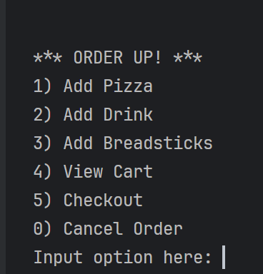
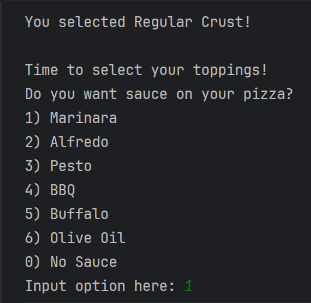
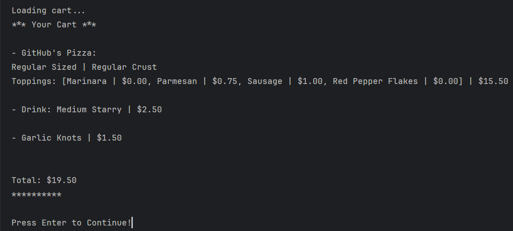
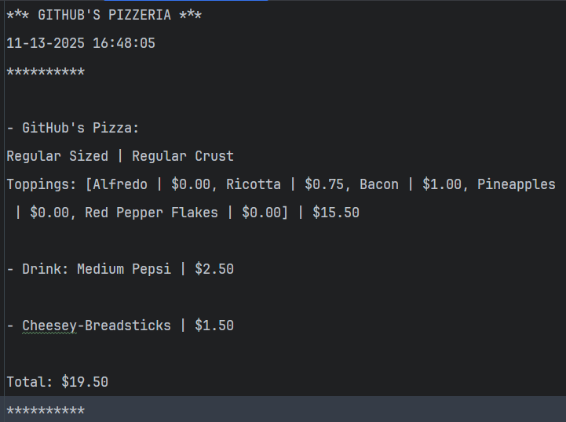

# The Pizzeria

### Project Overview
The goal of this program is to simulate what a Pizzeria's Made-to-Order (MTO)
system would look like and how it would function in a Command-Line Interface (CLI) aspect.

> The program allows the user to add and customize their own pizza(s), drink(s), and 
breadstick type to their order. The user can view their cart within the 
"Home Screen" along with being able to check out and/or cancel their order.

> If the user decides to check out, the program will print out a copy of what the
receipt will look like in the console, while also creating a text file of the receipt to a folder
within the project files. No need to worry if you do not have a folder for your receipts, as
the program takes care of that for you.

> If the user orders a drink, for example, and decides they want to cancel their order, the program
will clear the user's cart. So when the user logs back into the program, the cart will be
empty.

Below are some screenshots of what you can expect from the program as you run through it.

Additionally, there is a rough sketch of a program diagram for the visual learners out there.

### Program Screenshots

#### Home Screen / Main Menu

#### Ordering Pizza Screen

#### Viewing the Cart

#### Example Receipt

#### Program Diagram
